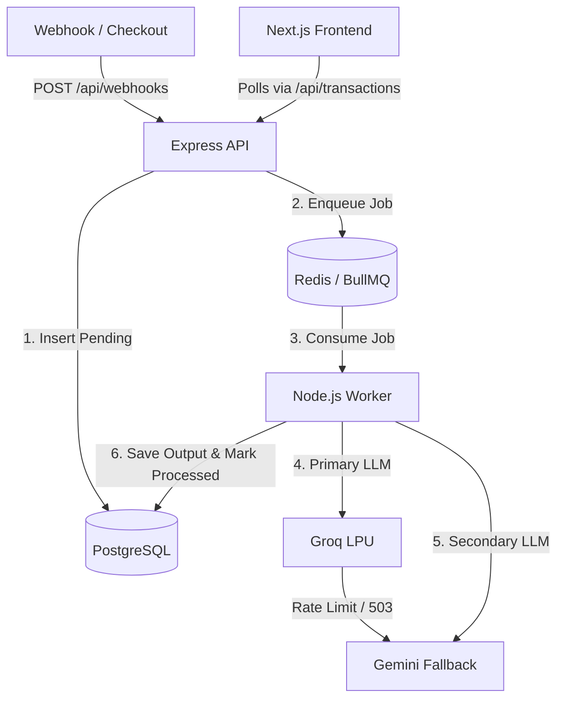

# AI Revenue Recovery Engine 🚀

An enterprise-grade, event-driven backend system and real-time dashboard built to automatically recover failed payment transactions. It utilizes a distributed message broker and a multi-model AI routing strategy to generate personalized SMS copy, complete with strict ACID compliance and zero-downtime fault tolerance.

---

## 🚀 Live Demo & 60-Second Quickstart

**Live Application:** [revenue-recovery-engine-r3usoqmag-kartik-agrawals-projects.vercel.app](https://revenue-recovery-engine-r3usoqmag-kartik-agrawals-projects.vercel.app)

To verify the event-driven background queue and AI processing in real-time, follow these 4 steps on the live dashboard:

1. **Inject a Webhook** — Click the **⚡ Inject Failed Payment** button. This fires a mock POST request to the backend webhook endpoint. Wait a few seconds for the frontend's 8-second polling to automatically display the new `FAILED` transaction in the table.
2. **Trigger the Queue** — Click **Run AI Recovery**. This pushes the failed transactions into the Redis-backed BullMQ message broker.
3. **Watch the Polling** — Do not refresh the page. Watch the table status automatically transition from `FAILED` ➡️ `IN PROGRESS` ➡️ `RECOVERED` as the backend's asynchronous workers process the jobs and the frontend polls the database.
4. **Audit the AI** — Once a transaction is marked as `RECOVERED`, click on the table row. A modal will appear showing the actual, dynamic SMS generated by the Groq/Gemini LLM for that specific customer.

---

## 🛠️ For Technical Judges (API Testing)

If you prefer to test the webhook ingestion endpoint manually via your own terminal, you can bypass the UI button and inject a payload directly into the production queue:

```bash
curl -X POST https://[YOUR-RENDER-URL].onrender.com/api/webhooks/payment-failed \
  -H "Content-Type: application/json" \
  -d '{
    "customer_name": "Bruce Wayne",
    "amount": 1500.00,
    "failure_reason": "bank_timeout"
  }'
```

> **Note:** After firing this cURL command, simply watch the live Vercel dashboard. The new transaction will appear automatically on the next polling cycle.

---

## 💡 The Business Case

When a payment fails (e.g., incorrect OTP, bank timeout), standard industry practice is to wait 24 hours and send a generic email. By that time, the user has closed the tab, and the sale is lost.

This system acts as an automated, instant sales agent. It catches failure webhooks in milliseconds and dispatches a personalized AI-generated SMS to rescue the revenue before the user puts their phone down.

---

## 🛠 Tech Stack

| Layer | Technology |
|---|---|
| **Frontend** | Next.js, React, Tailwind CSS (polling-based optimistic UI, atomic design system, client-side pagination) |
| **Backend Runtime** | Node.js, TypeScript, Express.js |
| **Database** | PostgreSQL (Neon Serverless) |
| **Message Broker** | BullMQ, Redis (Upstash) |
| **Primary AI** | Groq LPU (`llama-3.3-70b-versatile` via OpenAI SDK) |
| **Secondary AI** | Google Gemini (`gemini-3.6-flash`) |

---

## 🎨 UI Architecture & Scalability

The frontend is built using an **Atomic Design Architecture**, isolating components into strict boundaries (e.g., `Pagination`, `FilterBar`, `StatusBadge`, `Toast`). This guarantees zero cross-component re-render leakage (e.g., a dashboard polling timer will never disrupt a modal animation) and allows the application to cleanly scale as new transaction types and recovery metrics are introduced.

---

## 🏗 System Architecture

### 1. Instant Ingestion (Decoupling)
An Express webhook validates incoming failed payment payloads, safely writes them to PostgreSQL with a `pending` state, instantly pushes a job payload to a Redis queue, and returns a `200 OK`. This guarantees the webhook never times out waiting for AI inference.

### 2. Asynchronous Consumption (BullMQ)
An isolated BullMQ worker pulls jobs one at a time from Redis. This prevents API rate-limit threshold breaches while maintaining steady throughput, keeping the main Node.js event loop completely unblocked for incoming traffic.

### 3. Multi-Model LLM Routing (Graceful Degradation)
To guarantee sub-second SMS generation and zero downtime, the system employs a Primary/Secondary LLM strategy:

- **Primary:** Routes to Groq's LPUs for hyper-fast inference.
- **Failover:** If Groq experiences a rate limit (`429`) or server outage (`503`), a strict `try/catch` block intercepts the crash and seamlessly routes the identical prompt to the Gemini API fallback.
- **Backoff:** If both providers fail, BullMQ automatically re-queues the job using an exponential backoff algorithm (2s → 4s → 8s).

### 4. Atomic Audit & Completion
Upon successful generation, the worker opens a PostgreSQL micro-transaction to simultaneously insert the AI prompt/response into a foreign-key-linked `audit_logs` table and update the core transaction state to `processed`, fulfilling strict ACID compliance.

---

## 📊 Complexity Analysis

**Time Complexity:**
- $O(1)$ for webhook ingestion and queue pushing.
- Asynchronous processing throughput is strictly bound by $O(I)$, where $I$ is the inference latency of the active AI model.

**Space Complexity:**
- $O(N)$ for Redis memory allocation, where $N$ represents the queue depth of pending recovery jobs.

---

## 🏛 High-Level Design (HLD) & Data Flow



---

## 💻 Getting Started

### Prerequisites
- Node.js (v18+)
- PostgreSQL (e.g., Neon DB)
- Redis (e.g., Upstash)
- Groq API Key & Google Gemini API Key

### Installation

**1. Clone & Install:**
```bash
npm install
cd frontend && npm install
```

**2. Environment Variables:**
Copy `.env.example` to `.env` and fill in your PostgreSQL, Upstash Redis, Groq, and Gemini API keys.

**3. Run Services:**
```bash
# Terminal 1: Backend API & Worker
npm run dev
```
```bash
# Terminal 2: Next.js Frontend
cd frontend && npm run dev
```
