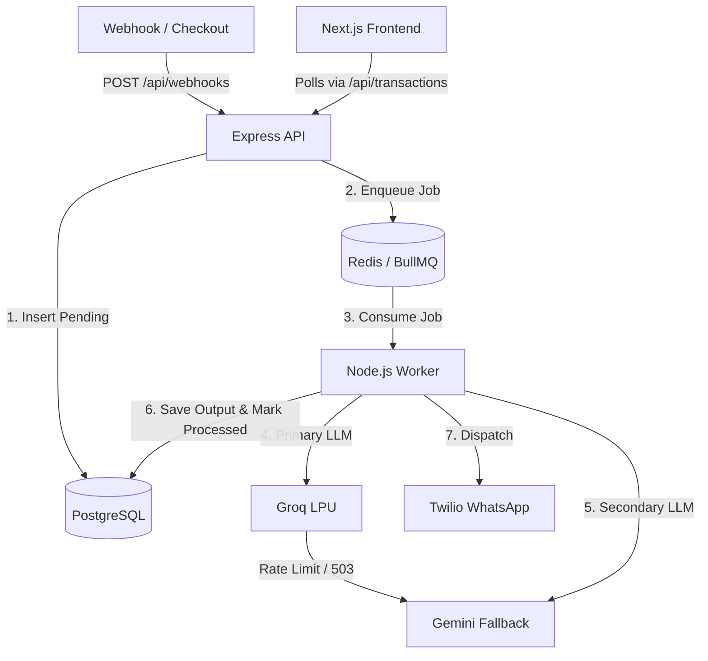

# AI Revenue Recovery Engine 🚀

An enterprise-grade, event-driven backend system and real-time dashboard built to automatically recover failed payment transactions. It utilizes a distributed message broker and a multi-model AI routing strategy to generate personalized SMS copy, complete with strict ACID compliance and zero-downtime fault tolerance.

## 💡 The Business Case

When a payment fails (e.g., incorrect OTP, bank timeout), standard industry practice is to wait 24 hours and send a generic email. By that time, the user has closed the tab, and the sale is lost. **This system acts as an automated, instant sales agent.** It catches failure webhooks in milliseconds and dispatches a personalized AI-generated SMS to rescue the revenue before the user puts their phone down.

## 🛠 Tech Stack

*   **Frontend:** Next.js, React, Tailwind CSS (Polling-based optimistic UI)
*   **Backend Runtime:** Node.js, TypeScript, Express.js
*   **Database:** PostgreSQL (Neon Serverless)
*   **Message Broker:** BullMQ, Redis (Upstash)
*   **Primary AI:** Groq LPU (`llama-3.3-70b-versatile` via OpenAI SDK)
*   **Secondary AI:** Google Gemini (`gemini-3.6-flash`)

## 🏗 System Architecture

### 1. Instant Ingestion (Decoupling)
An Express webhook validates incoming failed payment payloads, safely writes them to PostgreSQL with a `pending` state, instantly pushes a job payload to a Redis queue, and returns a `200 OK`. This guarantees the webhook never times out waiting for AI inference.

### 2. Asynchronous Consumption (BullMQ)
An isolated BullMQ worker pulls jobs one at a time from Redis. This prevents API rate-limit threshold breaches while maintaining steady throughput, keeping the main Node.js event loop completely unblocked for incoming traffic.

### 3. Multi-Model LLM Routing (Graceful Degradation)
To guarantee sub-second SMS generation and zero downtime, the system employs a Primary/Secondary LLM strategy:
*   **Primary:** Routes to Groq's LPUs for hyper-fast inference.
*   **Failover:** If Groq experiences a rate limit (`429`) or server outage (`503`), a strict `try/catch` block intercepts the crash and seamlessly routes the identical prompt to the Gemini API fallback. 
*   **Backoff:** If both providers fail, BullMQ automatically re-queues the job using an exponential backoff algorithm (2s → 4s → 8s).

### 4. Atomic Audit & Completion
Upon successful generation, the worker opens a PostgreSQL micro-transaction to simultaneously insert the AI prompt/response into a Foreign Key-linked `audit_logs` table and update the core transaction state to `processed`, fulfilling strict ACID compliance.

## 📊 Complexity Analysis

*   **Time Complexity:** 
    *   `O(1)` for webhook ingestion and queue pushing.
    *   Asynchronous processing throughput is strictly bound by `O(I)` where `I` is the inference latency of the active AI model.
*   **Space Complexity:** `O(N)` for Redis memory allocation, where `N` represents the queue depth of pending recovery jobs.

## 💻 Getting Started

### Prerequisites
*   Node.js (v18+)
*   PostgreSQL (e.g., Neon DB)
*   Redis (e.g., Upstash)
*   Groq API Key & Google Gemini API Key

### Installation

1. **Clone & Install:**
   ```bash
   npm install
   cd frontend && npm install
   ```
2. **Environment Variables:**
   Copy `.env.example` to `.env` and fill in your PostgreSQL, Upstash Redis, Groq, and Gemini API keys.
3. **Run Services:**
   ```bash
   # Terminal 1: Backend API & Worker
   npm run dev
   
   # Terminal 2: Next.js Frontend
   cd frontend && npm run dev
   ```

---

## 🏛 High-Level Design (HLD) & Data Flow

### The Architecture


### Why this Tech Stack?
1. **BullMQ + Redis:** Processing LLM requests synchronously in an Express route leads to HTTP timeouts (usually 30s) and blocks the Node.js single-threaded event loop. BullMQ guarantees *at-least-once* delivery and completely decouples ingestion from processing.
2. **PostgreSQL (Neon Serverless):** Relational data is crucial here. We need ACID compliance to ensure we never bill a customer twice or send duplicate SMS messages. Foreign keys tightly couple the `failed_transactions` to the `audit_logs`.
3. **Groq + Gemini Routing:** Groq LPUs provide the lowest latency TTFT (Time To First Token) for an instant response, while Gemini acts as a highly reliable fallback.

### Edge Cases Handled
- **Idempotency:** The webhook API accepts a unique transaction ID. If the exact same webhook fires twice (e.g. Stripe retries), Postgres unique constraints prevent duplicate processing.
- **API Outages:** Implemented graceful degradation. If Groq goes down, it seamlessly switches to Gemini. If both go down, the job goes into an exponential backoff retry loop inside BullMQ.

---

## 🎤 Interview FAQ (Defending the Architecture)

**Q: If the system automatically runs in the background 24/7, what happens if there's a massive spike in failed payments? Won't this spam the AI models and get our API keys blocked or banned?**
> **A:** No, the API keys are completely safe due to the implementation of the **Message Broker (BullMQ)** and **Stopping Rules**.
> 1. **Throttling:** The webhook ingests data instantly, but the BullMQ worker is configured to process jobs serially (or with a strict concurrency limit). It drips requests to the LLMs at a controlled, safe pace.
> 2. **Graceful Degradation:** If we do hit a provider's Rate Limit (`HTTP 429`), the worker catches the error and instantly falls back to the secondary provider (Gemini).
> 3. **Exponential Backoff:** If both providers return 429 errors, the worker safely places the job back into Redis with an exponential backoff delay (try again in 2s, then 4s, etc.).
> 4. **Hard Stopping Rule:** The system enforces a `MAX_RETRIES` limit (e.g., 3 attempts). If a job fails 3 times, it is marked as `failed_permanently` in the DB. This guarantees the system never enters an infinite loop of spamming the API.

**Q: Why did you decouple the system using Redis/BullMQ instead of just using standard `async/await` in the Express controller?**
> **A:** If we process the AI request inside the HTTP controller, a spike in traffic will exhaust the Node.js event loop or cause the external payment gateway to receive a timeout error (since LLM calls take 1-3 seconds). By decoupling, the Express API just writes to the DB and Redis (taking ~10ms) and returns `200 OK`. The worker then processes the queue at its own safe pace. 

**Q: Why use PostgreSQL instead of MongoDB for this?**
> **A:** Financial and recovery data requires strict ACID compliance. We use PostgreSQL because we need SQL Transactions. When the worker finishes generating the SMS, we must do two things simultaneously: insert the prompt into `audit_logs` and update the `recovery_status` to `processed`. If one succeeds and the other fails, we have corrupted state. A PostgreSQL transaction ensures both succeed or both fail.

**Q: How do you handle frontend updates if the processing happens asynchronously in the background?**
> **A:** The Next.js frontend uses a fast-polling optimistic UI pattern. Because the processing happens so fast (usually under 2 seconds with Groq), the dashboard polls the `/api/metrics` and `/api/transactions` endpoints every 2 seconds. This creates a real-time experience for the user without the overhead of maintaining complex WebSocket infrastructure.